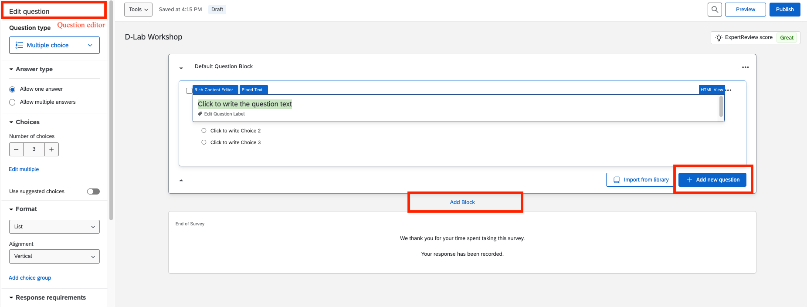
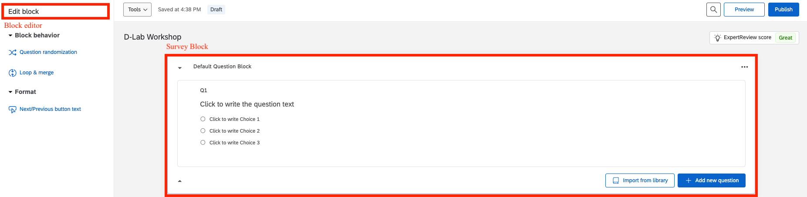
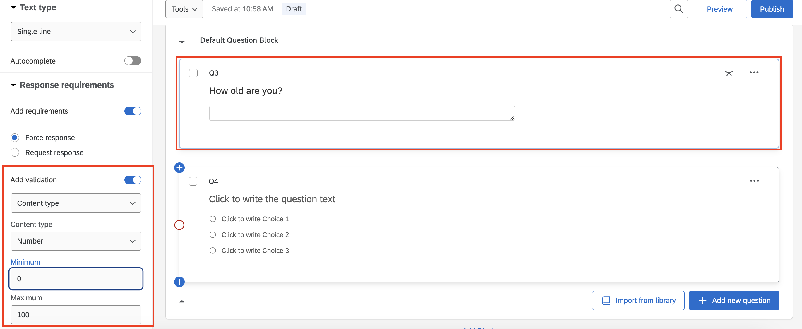
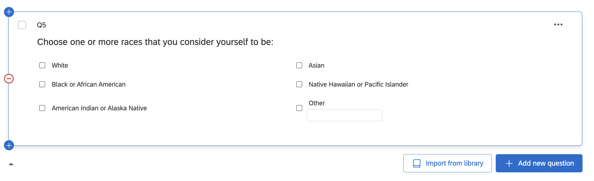
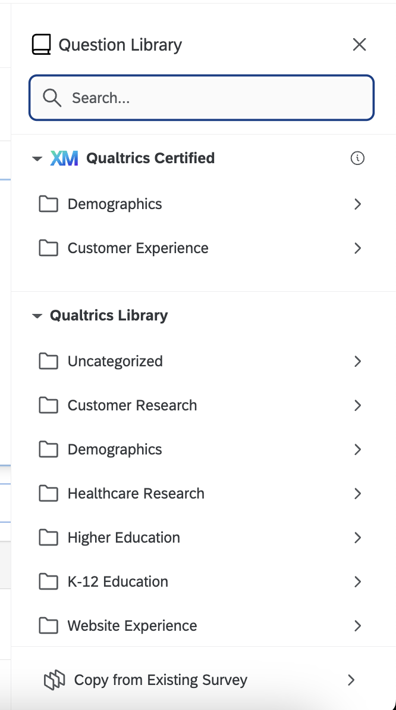
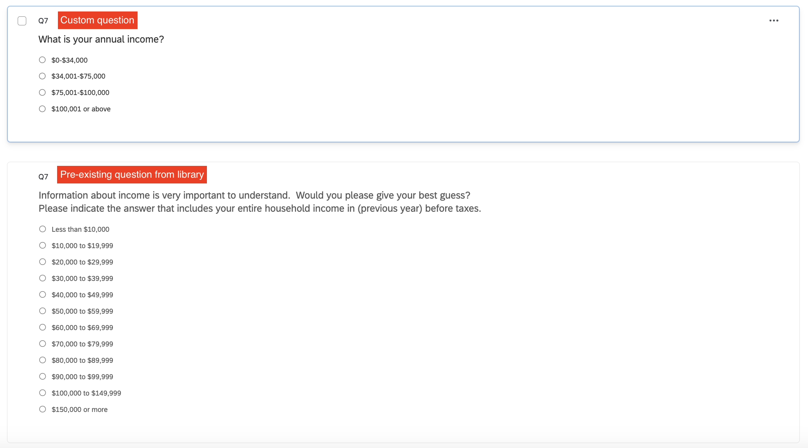
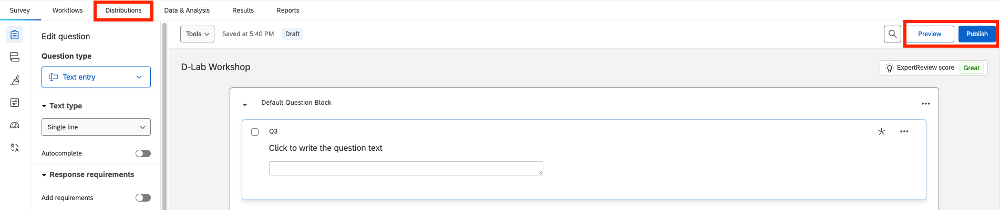
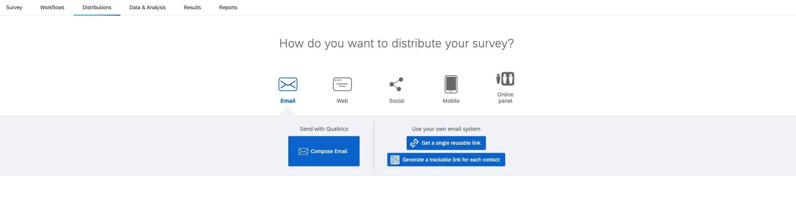
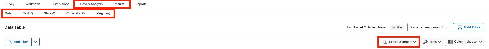
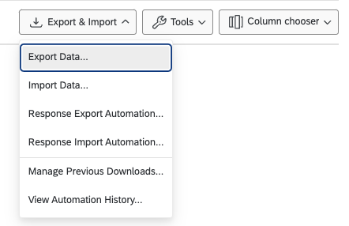

# Qualtrics Fundamentals Part 1

## Learning Objectives

Welcome to Part 1 of Qualtrics Fundamentals. This two-part workshop is designed to demonstrate the key features of a survey platform and the best practices for online survey research. Our goals for today's workshop are:

1.  Familiarize ourselves with the Qualtrics platform and its features.
2.  Create a survey together that uses different question types and design features.
3.  Learn how to distribute the survey and analyze data within the platform.

Throughout today's workshop, we will use the following icons:

🔔 **Question**: A quick question to help you understand what's going on.

💡 **Tip**: How to do something a bit more efficiently or effectively.

## Introduction

Qualtrics is one of the most commonly used survey platforms among researchers but its uses extend beyond academic research. Its uses include:

-   Seeking feedback (such as the forms at the of each DLab workshop)

-   Application forms for jobs

-   Running departmental and university-wide surveys

Across all these cases, it is important to know the various design features of the platform as well as the best practices for designing surveys so that we are able to ask the right questions and the information gathered is the most accurate and useful it can be for our purposes. Several design features and best practices travel across platforms beyond Qualtrics.

## New Survey in Qualtrics

You can log into Qualtrics using your Berkeley email address using this [link](https://berkeley.qualtrics.com/). Once you are logged in, you can create a new project using the blue button on the bottom left corner. You can then either create a survey from scratch or choose one of the templates in Qualtrics. Let's start by creating a survey from scratch.

{width="1913"}{width="1913"}

## Platform Design

Once you create a survey from scratch, you will see a screen that looks like the figure below. You should start by giving your survey a name in the box labeled 'Survey Title' below. Some of the key features of Qualtrics include:

1.  The distribution and analysis tools: the survey tab will bring you to the page where you edit your survey. The distributions tab allows you to send your survey to respondents. The data and analysis tab allows you to download and analyze your data once you have distributed your survey. The results page provides a summary by question. We will not cover the workflows and reports tabs in this workshop.
2.  The survey editing tools: the builder tab is where you create your survey, adding and editing questions. The survey flow tab controls how a respondent views the survey when taking it - here you can add screeners and randomizers of various types (we will work with survey flow mostly in part 2 and get a preview of it through randomization in today's workshop). Look and feel tab allows you to change the visual aesthetics of your survey. Under the survey options tab you can edit some basic features of your survey, such as how to deal with incomplete responses or adding validation features so the same respondent does not take your survey twice. The quotas tab allows you to set criteria for the number of respondents you want in your survey. For instance, if you want half your respondents to be women, you can choose that here. The translations tab allows you to translate your survey into other languages.

## Questions, Blocks, and Page Breaks

To add a question to your survey, you can use the 'Add new question' blue button. When a question is selected, the question editor will open on the left side of your screen. Here you can modify various features of the question (based on the question type), add response requirements, and skip/validation logic conditions (more on this soon). You can also double click on the question itself and the 'Rich content editor' and 'Piped text' options will pop up, which further allow you to modify the appearance and content of the question. You can also add a new block of questions by clicking the 'Add Block' button under the question block.

A 'Question Block' is one way of grouping a set of questions. Later in the workshop we will see why blocks are useful when modifying the survey flow. You can change the name of the question block

Once you start adding multiple questions, you will also be able to add page breaks between questions. You can modify the labels for question blocks and each questions by clicking on the boxes highlighted below.

## Designing a Survey

We will now design our own survey in Qualtrics to demonstrate the different types of questions that can be asked, the modifications that can be made to the survey flow, and the process of previewing and distributing a survey.

We will go through the following types of questions during this workshop and the full list of question types that one can ask in Qualtrics can be found [here](https://www.qualtrics.com/support/survey-platform/survey-module/editing-questions/question-types-guide/question-types-overview/):

-   [**Text entry:**]{.underline} both words and numeric. We can add a validation that allows us to define the type of content the respondent can type into a text entry box. Below, I add a validation that lets respondents enter only numbers between 0-100 for their age.

-   [**Multiple choice questions (one answer and multiple answers):**]{.underline} we will create our own multiple choice questions and import existing questions from the question library in Qualtrics. Below is an example of a question we will add by clicking on 'Import from library' which will open a question library. This library has pre-existing questions that are commonly used in surveys.

    

    {width="170"}

    We can also see comparisons between questions we may write ourselves and the questions that are pre-built into Qualtrics' library.

    🔔 **Question**: What are some of the differences between the two questions included below? How might they impact the responses we get?

    

-   [**Slider:**]{.underline} you can add slider scales with or without discrete points (called 'Increments' in Qualtrics).

-   [**Matrix table:**]{.underline} you can add Likert scales using matrix tables.

    -   While matrix tables can be efficient in asking multiple Likert scale questions, they may also lead to respondent fatigue and affect the quality of responses. See this blog [post](https://www.responsly.com/blog/matrix-questions/) for the advantages and pitfalls of matrix tables.

    💡 **Tip**: There are debates about which question type is better to use between sliding scales or Likert scales (see this [blog](https://www.checkmarket.com/blog/likert-scales-slider-scales/)). In cases where preferences may be more fluid (such as how much one likes a particular political party), slider scales might be more useful. In other cases where preferences may be more ranked and distinct (such as asking people the degree to which they agree or disagree with a statement), Likert scales may be more useful. See also Qualtrics' [guide](https://www.qualtrics.com/blog/three-tips-for-effectively-using-scale-point-questions/) on scale questions.

<!-- -->

-   [**Rank order:**]{.underline} these questions are particularly [helpful](https://www.qualtrics.com/blog/the-dos-and-donts-of-ranking-questions/) when you want to understand respondent preferences relative to each option presented and mirror respondent preferences to their real world choices more closely.

Along with these questions, we will also learn how to import questions from an [existing library](https://www.qualtrics.com/support/survey-platform/survey-module/editing-questions/question-types-guide/pre-made-qualtrics-library-questions/?parent=p0032) of questions and how to add skip/display logic to questions. [Display logic](https://www.qualtrics.com/support/survey-platform/survey-module/question-options/display-logic/) allows us to customize the questions a respondent sees based on their responses to specific questions. [Skip logic](https://www.qualtrics.com/support/survey-platform/survey-module/question-options/skip-logic/?parent=p0073) allows us to skip certain questions for respondents based on their responses to specific questions.

In the context of conducting online experiments, we will also see how to [randomize](https://www.qualtrics.com/support/survey-platform/survey-module/survey-flow/standard-elements/randomizer/) which question block appears for a respondent in survey flow.

Let's now head over to Qualtrics to create our survey!

## Previewing, Publishing, Distributing

Once your survey is ready, you should first preview what the survey will look like and whether it works the way you want it to work. To do this, you can click the preview button. Qualtrics allows you to preview what the survey will look like on the laptop and on the phone. If the survey works as intended, you can publish it which will make it ready for distribution.

There are various ways to distribute your survey. You can do it on your own by copying the link and sending it via email, phone, social media, etc. Some options are paid and require Qualtrics's representatives to distribute the survey (such as online panels).

## Take the survey!

Take a few minutes to take the survey we have just created together using the link in the chat.

## Data and Analysis

Once you have your data collected, Qualtrics lets you:

1.  Download the data in various formats
2.  Summarize the data by question
3.  Analyze it: text analysis, statistical analysis, etc.

### 🎬 Demo: Summary and Analysis

Let's head over to Qualtrics and see how we could summarize and analyze the data I have collected from all of you.

## Preview: Part 2

In part two, we will focus on some best practices to incorporate when creating surveys, which includes:

-   Randomizing questions and responses

-   Naming questions and blocks

-   Attention checks

-   Screeners and validations

... and much more!

## Resources

-   [Qualtrics Survey Support](https://www.qualtrics.com/support/survey-platform/survey-module/survey-module-overview/?parent=p0027) is a comprehensive guide on how to use the different features of Qualtrics.
