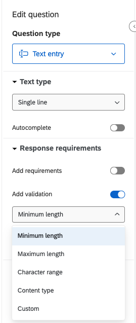

# Qualtrics Fundamentals Part 2

## Learning Objectives

Welcome to Part 2 of Qualtrics Fundamentals. This two-part workshop is designed to demonstrate the key features of a survey platform and the best practices for online survey research. Our primary goal for today is to learn some of the best practices of survey design.

Throughout this workshop series, we will use the following icons:

🔔 **Question**: A quick question to help you understand what's going on.

🥊 **Challenge**: Interactive exercise. We'll go through these in the workshop!

💡 **Tip**: How to do something a bit more efficiently or effectively.

🎬 **Demo:** Showing something more advanced or a demonstration of how to implement a feature.

## Recap of Part 1

-   We covered the features of the Qualtrics platform and designed our own survey.

-   We looked at the survey builder, how to preview and distribute our survey, how to download data, and how to analyze data within Qualtrics.

-   We also filled out the survey we created together.

## Introduction

Today's workshop will focus on several best practices to incorporate when designing your survey online. Some of the topics we will cover include:

-   Why should we randomize order of questions and responses to questions?

-   Why should we name questions and blocks in Qualtrics?

-   Why should we add screeners, validations, attention checks?

-   Should we have open ended questions?

-   Should we add forced response to questions?

There are many more best practices that one could incorporate into survey design - there are an entire semester's worth of courses that are taught on survey design. We will not cover all of these but we hope that this workshop will give you a baseline to start with and we will direct you to more resources for how to design good online surveys.

## Randomization

Randomizing the order in which respondents view questions and responses to questions is important when trying to mitigate order bias. Order bias refers to a systematic bias that can occur when questions (or responses) are presented to respondents in a particular order.

There are two main ways to implement question or response order randomization in Qualtrics:

1.  Randomize questions within a block or randomize block order (or both)
   

   

3.  Randomize the order of responses

   

💡 **Tip**: More on why [randomization](https://surveysparrow.com/blog/question-randomization/) works well in surveys.

## Naming

Naming questions and blocks in Qualtrics is particularly important because of the way Qualtrics handles adding and deleting questions.

🎬 **Demo**: Let's head over to Qualtrics and see how each question is labeled in the data tab and why this might pose a problem.

Adding labels to questions and blocks can help with

-   Survey flow management, especially with longer surveys

-   Easing data analysis with consistent labeling and easier data querying

-   Easing skip/display/conditional logic in questions

## Screeners and Validation

Screeners and data validation are important to ensure that the quality of survey data we get back is of high quality. This can include getting the right types of responses, ensuring respondents can only take the survey once, removing bad quality data, etc. Below are some of the different types of screeners and validation we should consider in survey design.

### Content validation

Certain questions demand specific types of responses and we want to ensure respondents do not fill out other kinds of responses. For instance, if you want respondents to enter a number when you ask for their age, you can set up data validation that will only allow for numeric responses. You can also create limits for the numbers they enter: the likelihood that somebody over the age of 100 taking a survey is fairly low and you can set an upper bound on the number respondents can put.

On Qualtrics, you can add a validation to a question by choosing the 'Add validation' option in the question editor and modifying the validation as per your requirement.

Using responses from certain questions, you can also set up screeners. For instance, if you want only adults from a certain geographic region to answer your survey, you can use responses to questions about age and state of residence to filter out specific responses.

On Qualtrics, you can add screeners via the 'Survey flow' tab by choosing to create 'Branches' in your survey. Respondents who fit your criteria will continue onto the rest of the questions in the survey and those who do not will be taken to the end of the survey.

#### 🥊 **Challenge 1**: Adding a validation and screener

Head over to Qualtrics and the survey we created together and add data validation to your question on age as well as a screener to filter out respondents under the age of 18 and those who live in a state other than California.

### Timers for survey and questions

Another type of data quality check that you can add to your survey is timers. You can add [timers](https://www.qualtrics.com/support/survey-platform/survey-module/editing-questions/question-types-guide/advanced/timing/?parent=p001134) to specific questions and you could filter out responses that are finished faster than a specific time limit that you set. When you add timers to questions, Qualtrics records the data related to each respondent. You could use this data, for instance, to filter out respondents who answer the question quickly or use the time taken to respond to the question as a control variable in a regression analysis.

Qualtrics flags respondents who finish surveys too quickly - they are called "speeders" and are respondents whose response time is "more than two standard deviations from the median duration it takes for your respondents to take the survey." Whether or not you should completely remove these speeders from your data requires careful consideration and reasoning. Some resources on how to deal with speeders in surveys are included below:

1.  Managing Respondent Speeding in Surveys by [Formplus](https://www.formpl.us/blog/survey-speeders-managing-respondent-speeding-in-surveys)
2.  Reducing speeding in web surveys by providing immediate feedback by [Conrad et al.](https://pmc.ncbi.nlm.nih.gov/articles/PMC6863515/) (2017)
3.  The Impact of Speeding on Data Quality in Nonprobability and Freshly Recruited Probability-based Online Panels by [Greszki, Meyer, and Schoen](https://www.sowi.uni-mannheim.de/media/Lehrstuehle/sowi/Schoen/PDFs/Greszki_Meyer_Schoen_2014_Impact_of_Speeding.pdf) (2014)

### Unique respondents

You can also prevent respondents from taking surveys multiple times. In Qualtrics, you can either prevent a respondent from taking the survey twice or you can flag their responses. To prevent them from taking the survey multiple times, you can use the [prevent multiple submissions](https://www.qualtrics.com/support/survey-platform/survey-module/survey-checker/fraud-detection/#PreventBallotBoxStuffing) option and choose either 'End survey with message' or 'Redirect to URL'. To flag their responses you can set this option to 'Flag responses' and you can enable [RelevantID](https://www.qualtrics.com/support/survey-platform/survey-module/survey-checker/fraud-detection/?utm_medium=product&utm_source=survey-builder#RelevantID). If you are sending your survey within an organization that uses the Single Sign On (SSO) feature, you can also enable authentication that makes a user log into their account to take the survey.

### Attention checks

Attention checks are an important way to ensure good quality data is collected through surveys. As the name suggest, these checks assess whether respondents are paying attention during the survey and answering questions thoughtfully. There are several types of attention checks one can incorporate into a survey. One of the most common ones is asking survey-takers to respond to instructions. A potential attention check question could be: "To indicate that you are paying attention to this question, please select 'Strongly Agree' from the options below."

You can also reverse-code responses, especially when using Likert scales, to see if respondents are paying attention. For instance, while one scale may be coded from (1) "Strongly Disagree" to (5) "Strongly Agree," another could be coded from (5) "Strongly Disagree" to (1) "Strongly Agree." Reverse-coding questions requires thoughtful consideration for question and response design. Some tips are included [here](https://verstaresearch.com/blog/tips-on-reverse-wording-survey-questions/).

Attention checks, if included, should be spread through the survey and constructed carefully.

## Open-Ended Questions

Survey experts vary on whether or not to include open-ended questions in surveys. On one hand, they can be very insightful, lead to new discoveries, and allow respondents to express themselves beyond multiple choice questions. On the other, they can increase survey fatigue and increase "bad" responses in the survey.

Here are some things to consider as you decide whether or not to include open-ended questions in your survey:

1.  Use them judiciously: do not add too many open-ended questions as it can increase respondent fatigue and increase the number of people who do not complete or drop out of your survey.
2.  Word them thoughtfully: be specific and precise when wording open-ended questions so respondent answers do not meander in different directions.
3.  Create an analysis plan: create a plan to analyze data, including the tools and methodologies you will use to make meaning and draw inferences from open-ended responses.

Qualtrics allows you to set the type of text response and the length of text response you want survey-takers to be limited to.

## Forced Response

Whether or not to mandate responses to questions before a respondent can proceed further in a survey is another contested topic. Requiring responses to questions can allow for more complete data to be collected but it can also increase dropout rates or decrease data quality (for instance, if respondents choose to answer inaccurately for sensitive topics). You can choose to make responses required in Qualtrics by adding 'Response requirements' and choosing either 'Force response' or 'Request response.'

Adding options for 'Prefer not to answer' and being selective in the use of forced response can help mitigate some of these concerns.

## Conclusion

These best practices for survey design only cover a handful of topics and considerations. Combined with an introduction to using Qualtrics, they should provide you with a foundation to start creating your own surveys on the platform. Many of these resources and tips transfer over to other survey platforms as well.

Here are some additional resources on how to create effective surveys:

-   [Qualtrics](https://www.qualtrics.com/blog/how-to-create-a-survey/): How to create an effective survey in 15 simple tips

-   [SurveyMonkey](https://www.surveymonkey.com/learn/survey-best-practices/): Survey best practices

-   [Institute of Education Sciences](https://ies.ed.gov/rel-west/2025/01/handout-creating-effective-surveys-best-practices-survey-design): Creating Effective Surveys

## Resources

-   DLab [Survey Fundamentals](https://github.com/dlab-berkeley/Survey-Fundamentals) workshop
